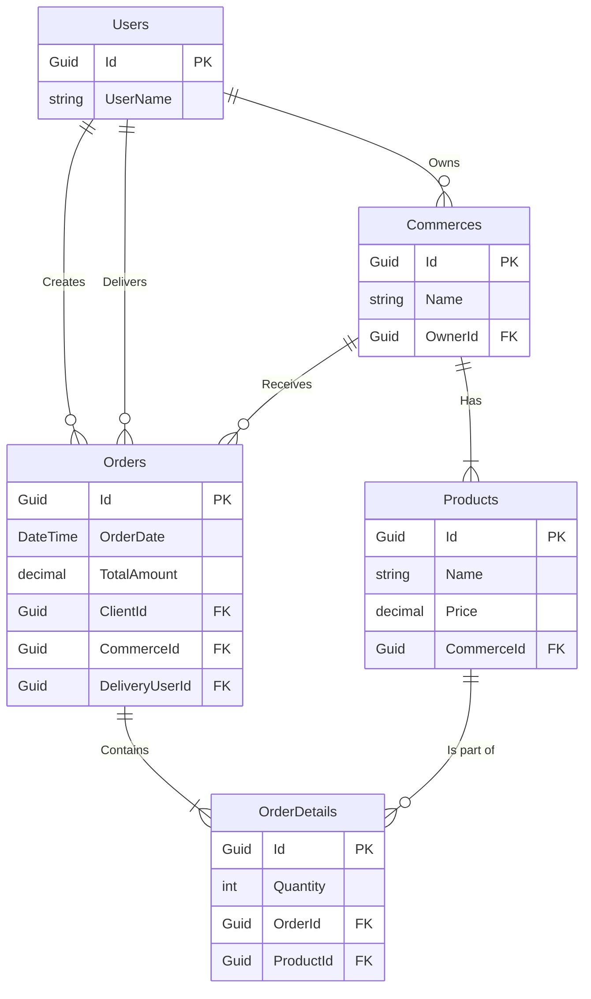

# 3. Esquema de la Base de Datos

La persistencia de datos se gestiona con **PostgreSQL** a través de **Entity Framework Core**. El diseño de la base de datos es un reflejo directo de las entidades del dominio y sus relaciones. La configuración del modelo se define en `Infrastructure/Persistence/ApplicationDbContext.cs`.

Por convención, las tablas se organizan en esquemas para una mejor separación lógica:

-   `auth`: Tablas relacionadas con la identidad y autenticación.
-   `commerce`: Tablas relacionadas con los negocios, productos y categorías.
-   `orders`: Tablas relacionadas con los pedidos y sus detalles.
-   `delivery`: Tablas relacionadas con los repartidores y grupos de reparto.

---

## 3.1. Tablas Principales

A continuación se describen las tablas más importantes y sus columnas clave.

### Esquema `auth`

-   **`Users`** (Hereda de `IdentityUser`)
    -   `Id` (Guid, PK): Identificador único del usuario.
    -   `UserName` (string): Nombre de usuario para el login.
    -   `Email` (string): Correo electrónico.
    -   `PasswordHash` (string): Hash de la contraseña.
    -   `FirebaseId` (string, nullable): ID de Firebase para integraciones.

-   **`Roles`** (Hereda de `IdentityRole`)
    -   `Id` (Guid, PK): Identificador único del rol.
    -   `Name` (string): Nombre del rol (`Cliente`, `Negocio`, `Repartidor`, `Admin`).

-   **`UserRoles`** (Tabla de unión)
    -   `UserId` (Guid, FK a `Users`)
    -   `RoleId` (Guid, FK a `Roles`)

### Esquema `commerce`

-   **`Commerces`**
    -   `Id` (Guid, PK): Identificador único del negocio.
    -   `Name` (string): Nombre del negocio.
    -   `Address` (string): Dirección física.
    -   `Phone` (string): Teléfono de contacto.
    -   `LogoUrl` (string, nullable): URL del logo.
    -   `OwnerId` (Guid, FK a `Users`): El usuario dueño del negocio.

-   **`Categories`**
    -   `Id` (Guid, PK): Identificador único de la categoría.
    -   `Name` (string): Nombre de la categoría (ej. "Comida Rápida").
    -   `Description` (string): Descripción.

-   **`Products`**
    -   `Id` (Guid, PK): Identificador único del producto.
    -   `Name` (string): Nombre del producto.
    -   `Description` (string): Descripción detallada.
    -   `Price` (decimal): Precio del producto.
    -   `ImageUrl` (string, nullable): URL de la imagen del producto.
    -   `Stock` (int): Cantidad disponible.
    -   `CommerceId` (Guid, FK a `Commerces`): El negocio al que pertenece el producto.

-   **`CommerceCategory`** (Tabla de unión para relación Muchos-a-Muchos)
    -   `CommerceId` (Guid, FK a `Commerces`)
    -   `CategoryId` (Guid, FK a `Categories`)

### Esquema `orders`

-   **`Orders`**
    -   `Id` (Guid, PK): Identificador único del pedido.
    -   `OrderDate` (DateTime): Fecha y hora de creación del pedido.
    -   `TotalAmount` (decimal): Monto total del pedido.
    -   `Status` (string): Estado actual del pedido (ej. `Pendiente`, `Entregado`). Se mapea desde el enum `OrderStatus`.
    -   `ClientId` (Guid, FK a `Users`): El cliente que realizó el pedido.
    -   `CommerceId` (Guid, FK a `Commerces`): El negocio que recibió el pedido.
    -   `DeliveryUserId` (Guid, nullable, FK a `Users`): El repartidor asignado.

-   **`OrderDetails`**
    -   `Id` (Guid, PK): Identificador único del detalle.
    -   `Quantity` (int): Cantidad de un producto específico.
    -   `UnitPrice` (decimal): Precio del producto al momento de la compra.
    -   `OrderId` (Guid, FK a `Orders`): El pedido al que pertenece este detalle.
    -   `ProductId` (Guid, FK a `Products`): El producto incluido en este detalle.

### Esquema `delivery`

-   **`DeliveryGroups`**
    -   `Id` (Guid, PK): Identificador único del grupo.
    -   `Name` (string): Nombre del grupo de reparto.
    -   `AssignmentMode` (string): Modo de asignación de pedidos (`Manual`, `Broadcast`).
    -   `AdminId` (Guid, FK a `Users`): El usuario administrador del grupo.

-   **`DeliveryGroupUser`** (Tabla de unión para la pertenencia de repartidores a grupos)
    -   `DeliveryGroupId` (Guid, FK a `DeliveryGroups`)
    -   `DeliveryUserId` (Guid, FK a `Users`)

---

## 3.2. Diagrama de Relaciones (Simplificado)

A continuación se presenta un diagrama conceptual de las relaciones clave:

